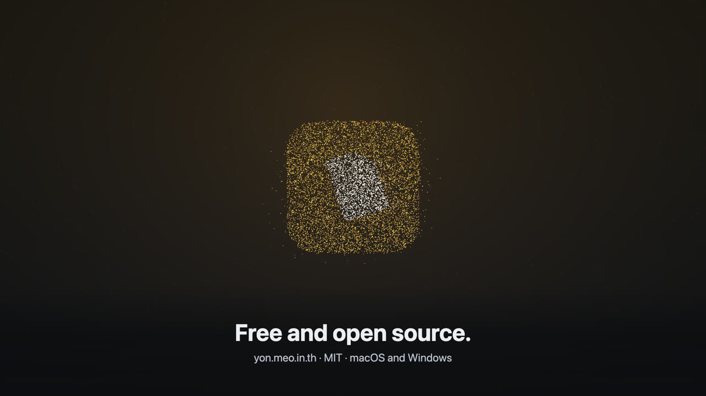

<p align="center">
  
</p>

<h1 align="center">Yon (โยน)</h1>

<p align="center">โยนไฟล์ไปหาอุปกรณ์ที่อยู่ใกล้ๆ</p>

<p align="center">
  <a href="https://yon.meo.in.th/">เว็บไซต์</a> ·
  <a href="https://yon.meo.in.th/film/">วิดีโอ</a> ·
  <a href="https://github.com/VacTuzX-dot/Yon/releases">ดาวน์โหลด</a> ·
  <a href="CHANGELOG.md">Changelog</a>
</p>

<p align="center">
  <a href="README.md">English</a> | ไทย
</p>

Yon (โยน) ส่งไฟล์และโฟลเดอร์ระหว่าง Mac, PC Windows และมือถือของคุณ ไม่ต้องสมัครบัญชี ไม่ผ่านคลาวด์ ไฟล์ไปจากเครื่องหนึ่งถึงอีกเครื่องโดยตรงและเข้ารหัสตลอดทาง ฟรีและเป็นโอเพนซอร์ส (MIT)

[](https://yon.meo.in.th/film/)

<p align="center"><a href="https://yon.meo.in.th/film/"><b>▶ ดู "Yon in 90 seconds"</b></a><br>วิดีโอ WebGL พร้อมเพลงที่สร้างจากโค้ด ทำจากโค้ดใน repo นี้</p>

## อัปเดต

- **2026-10-09:** Yon 0.2.5 ไอคอน Yon บนมือถืออันเดียวใช้กับคอมได้ทุกเครื่อง (แตะ **Add computer** แล้วสแกนโค้ดในไอคอนเลย) และหน้า Pair a phone มีแอนิเมชันสอนทีละขั้น [Changelog](CHANGELOG.md)
- **2026-10-01:** Yon 0.2.4 เปิด Yon ตอน login ได้ (macOS และ Windows ปิดไว้เป็นค่าเริ่มต้น และเริ่มแบบไม่มีหน้าต่างจึงใช้หน่วยความจำน้อยลงมาก) ประวัติ Activity อยู่ข้ามการรีสตาร์ท และวิดีโอที่สอง [Changelog](CHANGELOG.md)
- **2026-09-29:** Yon 0.2.3 ส่งโฟลเดอร์ได้, รองรับ Mac Intel และ Windows บน ARM, รายการ Activity, การแจ้งเตือนเล็กลง และแก้ช่องโหว่ด้านความปลอดภัย [Changelog](CHANGELOG.md)
- **2026-09-29:** [yon.meo.in.th](https://yon.meo.in.th/) เปิดแล้ว มีปุ่มดาวน์โหลดและวิดีโอ

## ทำอะไรได้บ้าง

- **หาอุปกรณ์เอง** อุปกรณ์ Yon อื่นบน Wi-Fi เดียวกันขึ้นมาให้อัตโนมัติ
- **ไฟล์และโฟลเดอร์** เลือกอุปกรณ์ เลือกไฟล์ แล้วส่ง ถ้าจะส่งโฟลเดอร์ ให้ลากไปวางบนอุปกรณ์ หรือเลือก **Send a folder…** จากเมนู ⋯ ของอุปกรณ์ โฟลเดอร์จะไปถึงเป็นโฟลเดอร์ใหม่พร้อมของข้างในครบ
- **คุณตัดสินใจว่าจะรับอะไร** ฝั่งรับเห็นว่าใครส่ง รายการไฟล์ และขนาดรวม แล้วเลือก **Accept** หรือ **Decline** ทั้งสองฝั่งเห็นความคืบหน้าและกดยกเลิกได้
- **ไฟล์ใหญ่ไม่มีปัญหา** ไฟล์ถูกส่งแบบสตรีม ไฟล์ 1 GB ใช้หน่วยความจำแค่ไม่กี่ MB และทุกไฟล์ถูกตรวจ SHA-256 เมื่อไปถึง
- **ไม่เขียนทับไฟล์เดิม** ไฟล์ที่รับไปอยู่ที่ `Downloads/Yon` (เปลี่ยนได้) ถ้าชื่อซ้ำจะเป็น `photo (1).jpg`
- **ส่งจากตัวจัดการไฟล์ได้เลย** Windows: คลิกขวา → **Send to → Yon** macOS: **Share → Yon**, **Open With → Yon** หรือลากไฟล์ไปวางที่ไอคอน Yon บน Dock
- **มือถือโดยไม่ต้องลงแอป** ส่งระหว่างมือถือกับคอมด้วย [Yon Link](docs/yon-link.md) (เอกสารภาษาอังกฤษ)
- **อยู่เบื้องหลังได้** macOS: ปิดหน้าต่าง (⌘W) แล้ว Yon ยังอยู่ที่ menu bar และซ่อนไอคอน Dock ได้ใน Settings Windows: ปิดหน้าต่างแล้วย่อลง tray (ปิดพฤติกรรมนี้ได้ใน Settings) ตั้งแต่ 0.2.4 เปิด **Open Yon when I log in** ใน Settings ให้ Yon เริ่มทำงานแบบซ่อนหลังรีสตาร์ตเครื่อง จะออกจากโปรแกรมให้ใช้ไอคอนที่ menu bar หรือ tray หรือ ⌘Q บน macOS

## ติดตั้ง

ดาวน์โหลดจาก [yon.meo.in.th](https://yon.meo.in.th/) เลือก Mac หรือ Windows แล้วไฟล์จะโหลดทันที หรือเลือกจาก [Releases](https://github.com/VacTuzX-dot/Yon/releases) ซึ่งหน้าแรกของแต่ละเวอร์ชันมีตารางลิงก์ดาวน์โหลดตรง

| เครื่องของคุณ | ไฟล์ |
|---|---|
| Mac ชิป Apple Silicon (M1 ขึ้นไป) | `Yon_x.y.z_aarch64.dmg` |
| Mac Intel (0.2.3 ขึ้นไป) | `Yon_x.y.z_x64.dmg` |
| Windows x64 (Intel หรือ AMD) | `Yon_x.y.z_x64-setup.exe` |
| Windows บน ARM เช่น Snapdragon (0.2.3 ขึ้นไป) | `Yon_x.y.z_arm64-setup.exe` |

ไม่รองรับ Windows 32 บิต ตอนนี้ยังไม่ได้ notarize กับ Apple และยังไม่ได้เซ็นสำหรับ Windows ระบบปฏิบัติการจึงเตือนตอนเปิด Yon ครั้งแรก การเปลี่ยนแปลงของแต่ละเวอร์ชันและปัญหาที่รู้พร้อมวิธีแก้ดูที่ [CHANGELOG](CHANGELOG.md)

### macOS

**ผ่าน Terminal (ข้ามคำเตือนตอนเปิดครั้งแรก):**

```bash
curl -fsSL https://yon.meo.in.th/mac | bash
```

[สคริปต์](install.sh) ดาวน์โหลดรุ่นล่าสุด ตรวจกับ `SHA256SUMS.txt` ของ release และลายเซ็นของแอป แล้วใส่ Yon ไว้ใน `/Applications` โดยไม่ใช้ `sudo` ไฟล์ที่โหลดด้วยวิธีนี้ไม่ถูกทำเครื่องหมายว่ามาจากอินเทอร์เน็ต macOS จึงเปิด Yon ได้ทันที สคริปต์เชื่อใจ GitHub เท่ากับไฟล์ DMG ถ้าอยากอ่านก่อนรันก็ทำได้ รันซ้ำเมื่อไรก็ได้เพื่อติดตั้งใหม่

**ผ่านไฟล์ DMG:**

1. เปิดไฟล์ `.dmg` แล้วลาก Yon ไปที่ Applications
2. เปิด Yon ถ้า macOS บอกว่า "could not verify" ให้เปิด System Settings → Privacy & Security แล้วกด **Open Anyway** ทำครั้งเดียวพอ
3. เมื่อมีข้อความถาม ให้อนุญาตให้ Yon หาอุปกรณ์ในเครือข่ายภายใน
4. ทางเลือก สำหรับ **Share → Yon**: เปิด Yon ที่ System Settings → General → Login Items & Extensions → Sharing (macOS ปิด share extension ใหม่ไว้จนกว่าคุณจะเปิดเอง) บิลด์ที่ไม่ได้เซ็นอาจไม่มี Share extension เลย ส่วน Open With ใช้ได้เสมอ

### Windows

1. รัน installer
2. ถ้า SmartScreen ขึ้น "Windows protected your PC" ให้กด **More info** → **Run anyway**
3. เมื่อ Windows Firewall ถาม ให้อนุญาต Yon บน **Private networks**

ติดตั้งผ่าน PowerShell (ขั้นสูง) ดูวิธีและข้อควรระวังใน [README ภาษาอังกฤษ](README.md#windows)

### อัปเดต Yon

Yon เช็ก GitHub Releases หาเวอร์ชันใหม่ไม่นานหลังเปิดและทุกไม่กี่ชั่วโมง เมื่อมีตัวใหม่ จะมีแถบที่ด้านล่างหน้าต่างบอก กด **Update** แล้ว Yon จะโหลด ติดตั้งทับของเดิม และเปิดใหม่ให้

ปิดการเช็กอัตโนมัติหรือกดเช็กเองได้ที่ **Settings → Updates** การอัปเดตจาก 0.2.0 (ทุกระบบ) หรือจาก 0.2.1 บน macOS ต้องทำเพิ่มหนึ่งขั้นตอน ดู [CHANGELOG](CHANGELOG.md)

### ตรวจไฟล์ที่ดาวน์โหลด

ทุก release มี `SHA256SUMS.txt` วางไว้ข้างไฟล์ที่โหลดแล้วรัน:

```bash
shasum -a 256 --ignore-missing -c SHA256SUMS.txt
```

บน Windows (PowerShell) ให้เทียบผลของ `Get-FileHash .\Yon_x.y.z_x64-setup.exe` กับบรรทัดที่ตรงกันใน `SHA256SUMS.txt`

## ส่งจากมือถือ

**Yon Link** ให้ iPhone หรือ Android ส่งรูปและไฟล์ไปที่คอม และรับไฟล์จากคอม ผ่านหน้าเว็บเล็กๆ ที่ Yon เปิดให้บน Wi-Fi ไม่ต้องลงอะไรจากแอปสโตร์

1. บนคอม: **Settings → Phones → Pair a phone** จะมี QR code ขึ้นมา
2. บนมือถือ: สแกนโค้ดด้วยกล้องแล้วแตะลิงก์
3. แตะ Share → **Add to Home Screen**

จากนั้นแตะไอคอน Yon บนมือถือได้เลย การส่งจากคอมไปมือถือ มือถือไปมือถือ การใช้นอกบ้าน และการรัน relay เอง อยู่ใน [Yon Link](docs/yon-link.md) (ภาษาอังกฤษ) มือถือเครื่องเดียวใช้กับคอมได้สูงสุด 4 เครื่อง ดูวิธีเพิ่มคอมเครื่องอื่นได้ที่หัวข้อ [Use one phone with several computers](docs/yon-link.md#use-one-phone-with-several-computers) (ภาษาอังกฤษ)

## ความปลอดภัย

- ทุกเครื่องที่ติดตั้งมีคีย์ Ed25519 ของตัวเอง คอมคุยกันผ่าน mutual TLS 1.3 และฝั่งส่งตรวจว่ากำลังคุยกับอุปกรณ์เครื่องที่ค้นพบเป๊ะๆ
- ฝั่งรับเห็น **device code** ของผู้ส่ง ไม่ใช่แค่ชื่อที่ปลอมได้
- ไม่มีอะไรถูกเขียนลงเครื่องจนกว่าคุณจะกด Accept (ยกเว้นคุณเลือก "Always accept" ให้อุปกรณ์นั้น) ชื่อไฟล์และโฟลเดอร์ถูกทำความสะอาดเพื่อไม่ให้หลุดออกนอกโฟลเดอร์ที่บันทึกหรือเขียนทับของเดิม
- Yon รับการเชื่อมต่อจากที่อยู่เครือข่ายส่วนตัวเท่านั้น ระหว่างที่ทำงาน มันฟังคำขอบนเครือข่ายภายใน: ออกจากโปรแกรมเมื่อไม่อยากรับอะไร
- การอัปเดตถูกเซ็นและตรวจกับคีย์ที่ฝังในแอป การเช็กอัปเดตเป็นคำขอเดียวที่ Yon ส่งออกนอกเครือข่ายภายใน
- **Yon Link ป้องกันน้อยกว่าตัวแอป** หน้าเว็บมือถือเป็น `http` ธรรมดาบน LAN คำขอหลังโหลดหน้าถูกเข้ารหัสด้วยคีย์จับคู่ของมือถือ แต่คนที่ดัดแปลงทราฟฟิก Wi-Fi ของคุณได้อาจแก้หน้าเว็บและขโมยคีย์นั้นได้ ให้ปฏิบัติต่อ QR code เหมือนรหัสผ่าน และลบมือถือใน Settings เพื่อตัดการเข้าถึง

ข้อจำกัดที่รู้: รองรับ IPv4 เท่านั้น, คีย์เป็นไฟล์ ไม่ได้อยู่ใน keychain ของระบบ และบิลด์ยังไม่ได้เซ็น รายละเอียดทั้งหมด: [Security](docs/security.md) (ภาษาอังกฤษ)

## สำหรับนักพัฒนา

ดูวิธีรัน ทดสอบ และ build ใน [README ภาษาอังกฤษ](README.md#development)

## แผนงาน

- **ถัดไป:** ส่งข้อความและ clipboard, ประวัติการส่ง
- **หลังจากนั้น:** ส่งข้ามเครือข่าย (ผ่าน [iroh](https://iroh.computer)), รองรับ LocalSend เป็นทางเลือก, แอปมือถือ

## ไลเซนส์

[MIT](LICENSE)
